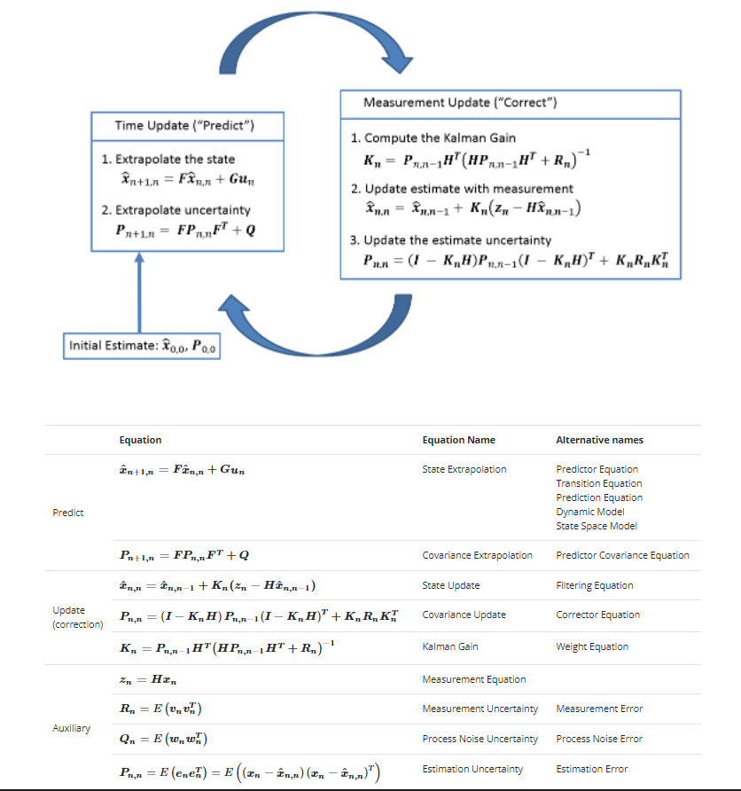

# kalmanImuTest
it`s qt project for test and debug kalman filter with coordinate, velocity and quaternion

# Based on scientific article: 
"A New Quaternion-Based Kalman Filter for Real-Time Attitude Estimation Using the Two-Step
Geometrically-Intuitive Correction Algorithm"
 
Kaiqiang Feng, Jie Li, Xiaoming Zhang, Chong Shen, Yu Bi, Tao Zheng and Jun Liu
 
 
DOI:10.3390/s17092146
 
https://www.mdpi.com/1424-8220/17/9/2146

## Kalman theory:

  

